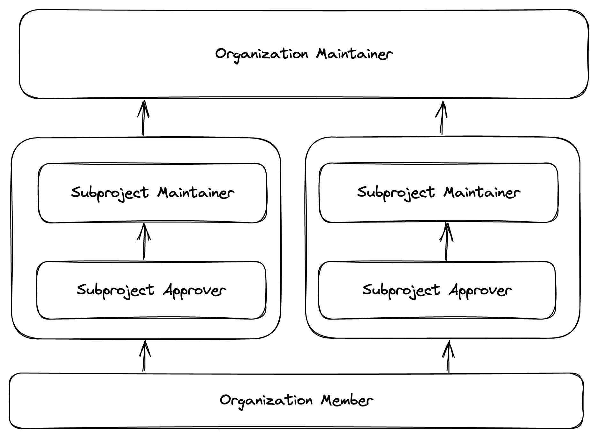

# Community Membership
(Adapted from [Kubernetes Community Membership](https://github.com/kubernetes/community/blob/master/community-membership.md))

This document outlines the various responsibilities of contributor roles in K8sGPT. The project is subdivided into 
subprojects. Responsibilities for most roles are scoped to a subproject. The subprojects are defined in the [subprojects](subprojects.md) document. Repositories which are not part of the list, are managed by the [organization maintainers](#Organization-Maintainer).

## Roles

Currently, following roles are defined:

| Role                                                | Scope        | Responsibilities                              | Requirements                                                                    | Defined by                                             |
|-----------------------------------------------------|--------------|-----------------------------------------------|---------------------------------------------------------------------------------|--------------------------------------------------------|
| [New Contributors](#New-Contributors)               | Organization | Getting familiar with the project             | N/A                                                                             | N/A                                                    |
| [Member](#Member)                                   | Organization | Active contributor to the community           | Sponsored by 2 approvers/maintainers and multiple contributions to the project  | K8sGPT GitHub Organization member                      |
| [Approver](#Approver)                               | Subproject   | Contributions acceptance approval             | Highly experienced active reviewer and contributor to a subproject              | [OWNERS] file approver entry                           |
| [Subproject maintainer](#Subproject-Maintainer)     | Subproject   | Set direction and priorities for a subproject | Demonstrated responsibility and excellent technical judgment for the subproject | subproject [OWNERS] file maintainers entry             |
| [Organization maintainer](#Organization-Maintainer) | Organization | Set direction and priorities for the project  | Demonstrated responsibility and excellent technical judgment for the project    | [[MAINTAINERS](MAINTAINERS.md)] file maintainers entry |

As a result, the following illustration shows the contributor ladder:

### New Contributors 
New contributors should be welcomed to the community by existing members, helped with PR workflow, and directed to relevant documentation and communication channels.

## Member
Members are continuously active contributors in the community. They can have issues and PRs assigned to them, participate in Subprojects through GitHub teams, and pre-submit tests are automatically run for their PRs. Members are expected to remain active contributors to the community.

**Defined by:** Member of the K8sGPT GitHub organization

### Requirements
* Enabled [two-factor authentication] on their GitHub account
* Have made multiple contributions to the project or community. Contribution may include, but is not limited to:
  * Authoring or reviewing PRs on GitHub. At least one PR must be merged.
  * Filing or commenting on issues on GitHub
  * Contributing to subproject, or community discussions (e.g. meetings, Slack, email discussion forums, Stack Overflow)
* Have read the [contributor guide]
* Actively contributing to 1 or more subprojects.
* Sponsored by 2 subproject maintainers/approvers. Note the following requirements for sponsors:
  * Sponsors must have close interactions with the prospective member - e.g. code/design/proposal review, coordinating on issues, etc.
  * Sponsors must be reviewers or approvers in at least one OWNERS file within one of the [K8sGPT GitHub organizations].
  * Sponsors must be from multiple member companies to demonstrate integration across the community.
* Open an issue against the K8sGPT/community repository
  * Ensure your sponsors are @mentioned on the issue
  * Make sure that the list of contributions included is representative of your work on the project. 
* Have your sponsoring reviewers reply with confirmation of sponsorship: +1

## Approver
Code approvers are able to both review and approve code contributions. While code review is focused on code quality and correctness, approval is focused on holistic acceptance of a contribution including backward/forward compatibility, adhering to API and flag conventions, subtle performance and correctness issues, interactions with other parts of the system, etc.

**Defined by:** Approvers entry in an OWNERS file in a repo owned by the K8sGPT project. Approver status is scoped to a part of the codebase.

### Requirements
The following apply to the part of the codebase for which one would be an approver in an [OWNERS] file.
* Active contributor to the codebase for at least 3 months
* Primary reviewer for at least 5 substantial PRs to the codebase
* Reviewed or merged at least 10 PRs to the codebase
* Nominated by a subproject maintainer
  * With no objections from other subproject owners
  * Done through PR to update the top-level OWNERS file 

### Responsibilities and privileges
The following apply to the part of the codebase for which one would be an approver in the [OWNERS] file of the repository. 
* Approver status may be a precondition to accepting large code contributions
* Demonstrate sound technical judgment
* Responsible for project quality control via [code reviews]
  * Focus on holistic acceptance of contribution such as dependencies with other features, backward / forwards compatibility, API and flag definitions, etc
* Expected to be responsive to review requests as per [community expectations]
* Mentor new contributors
* May approve code contributions for acceptance

## Subproject Maintainer
Note: This is a generalized high-level description of the role, and the specifics of the subproject owner role's responsibilities and related processes CAN be defined for individual subprojects.
Subproject Maintainers are the technical authority for a subproject in the K8sGPT project. They MUST have demonstrated both good judgement and responsibility towards the health of that subproject. Subproject Maintainers MUST set technical direction and make or approve design decisions for their subproject - either directly or through delegation of these responsibilities.
Defined by: owners entry in subproject [OWNERS] files.

### Requirements
Unlike the roles outlined above, the Maintainers of a subproject are typically limited to a relatively small group of decision-makers and updated as fits the needs of the subproject.
The following apply to the subproject for which one would be a maintainer.
* Deep understanding of the technical goals and direction of the subproject
* Deep understanding of the technical domain of the subproject
* Sustained contributions to design and direction by doing all of:
  * Authoring and reviewing proposals
  * Initiating, contributing and resolving discussions (emails, GitHub issues, meetings)
  * Identifying subtle or complex issues in designs and implementation PRs
* Directly contributed to the subproject through implementation and / or review
* For new projects, the first subproject maintainers are typically the founder of the subproject and elected with a majority vote of the organization maintainers. If the subproject has more than two maintainers, new maintainers are elected by a majority vote of the subproject maintainers

### Responsibilities and privileges
The following apply to the subproject for which one would be a maintainer.
* Make and approve technical design decisions for the subproject.
* Set technical direction and priorities for the subproject.
* Define milestones and releases.
* Mentor and guide approvers, and contributors to the subproject.
* Ensure continued health of subproject
  * Adequate test coverage to confidently release
  * Tests are passing reliably (i.e. not flaky) and are fixed when they fail
* Ensure a healthy process for discussion and decision making is in place.
* Work with other subproject maintainers to maintain the project's overall health and success holistically

## Organization Maintainer
Organization maintainers provide technical oversight for the overall architectural design and project development.

*Defined by:* maintainers entry in the [MAINTAINERS](MAINTAINERS.md) file.

### Requirements
* Deep understanding of the technical goals and direction of the project
* Deep understanding of the technical domain of the project
* Actively attend the community meetings
* Regularly triage GitHub issues
* Make sure that ongoing PRs are moving forward at the right pace or closing them
* Monitor K8sGPT Slack (delayed response is perfectly acceptable), particularly for the area of your expertise
* Can be nominated by every member, needs at least one organization maintainer as sponsor and is elected by a majority vote of the organization maintainers.

### Responsibilities and privileges
The following apply to the project as a whole. Responsibilities and privileges may be subject to change when a governance structure (Technical Committee / Governance Committee) is in place.
* Organization Maintainers are the maintainers reported to a foundation the project might be donated with the corresponding voting and execution rights for the project.
* Make and approve technical design decisions for the project together with other maintainers.
* Set technical direction and priorities for the project.
* Define milestones and releases.
* Mentor and guide approvers, reviewers, and contributors to the project.
* Ensure continued health of the project
  * Adequate test coverage to confidently release
  * Tests are passing reliably (i.e. not flaky) and are fixed when they fail
* Ensure a healthy process for discussion and decision-making is in place.

## Inactive Members / Emeritus
Life priorities, interests, and passions can change. Maintainers can retire and move to emeritus maintainers. If a maintainer needs to step down, they should inform other maintainers, if possible, help find someone to pick up the related work. At the very least, ensure the related work can be continued. Afterward they can remove themselves from list of existing maintainers.

If a maintainer has not been performing their duties for period of 6 months, they can be removed by other maintainers. In that case inactive maintainer will be first notified via an email. If situation doesn't improve, they will be removed. If an emeritus maintainer wants to regain an active role, they can do so by renewing their contributions. Active maintainers should welcome such a move. Retiring of other maintainers or regaining the status should require approval of at least two active maintainers.

## Involuntary removal or demotion
Involuntary removal/demotion of a contributor happens when responsibilities and requirements aren't being met. This may include repeated patterns of inactivity, extended period of inactivity, a period of failing to meet the requirements of your role, and/or a violation of the Code of Conduct. This process is important because it protects the community and its deliverables while also opens up opportunities for new contributors to step in.

Involuntary removal or demotion is handled through a vote by a majority of the current subproject maintainers for subproject approvers or the majority of organization maintainers for subproject maintainers.

## Nomination process
Whenever people are nominated for a role in the project, the following rules apply:
* Sponsors must be affiliated to a different company than the nominee
* If multiple sponsors are needed, the sponsors have to be affiliated to at least 2 companies
* The approval issue for nominees have to stay open at least one week for comments. The sponsors must express their support by commenting "+1" on the issue. Other project and subproject maintainers can express their support or objections by commenting "-1" on the issue. If there is no consensus for granting the role to the nominee after 4 weeks, the nomination will be rejected and the issue closed.
